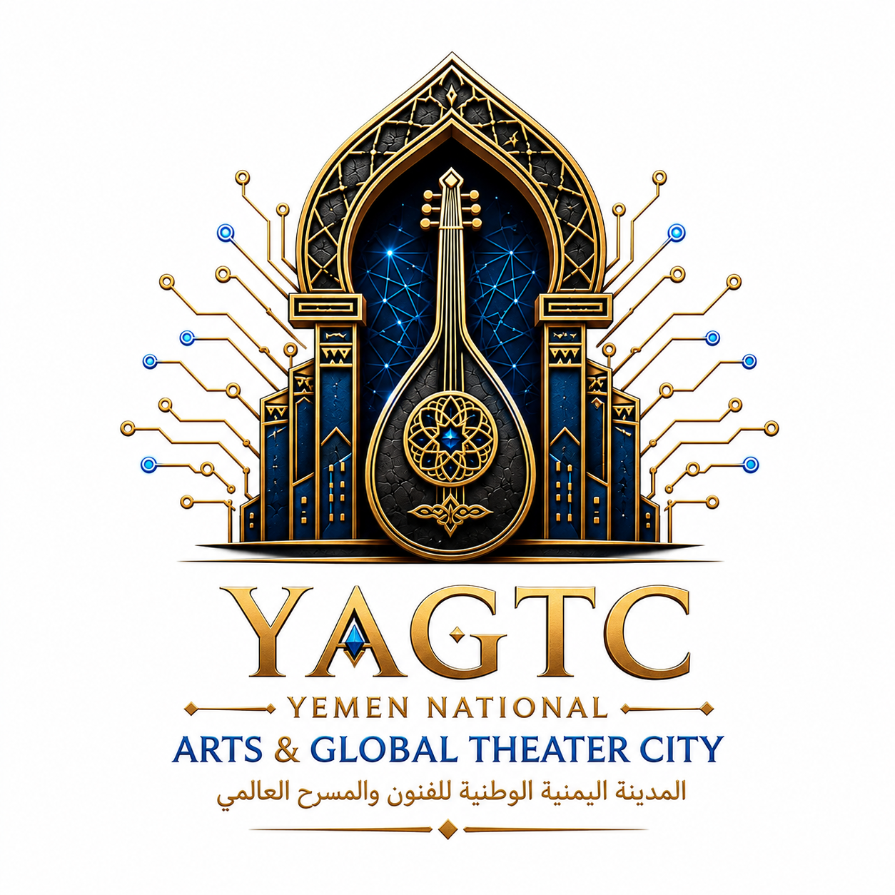

# 🏛️ Yemen National Arts & Global Theater City (YAGTC)

<p align="center">
  
</p>


## 📜 وثيقة إثبات الملكية الفكرية والريادية الحصرية للمشروع
* **المبتكر والمطور الرئيسي الحصري**: المهندس/ أوسان عادل عبدالباري أحمد سلطان
* **الرقم التعريفي المعتمد (ID)**: ID.01010305468
* **الحساب المهني الرسمي (LinkedIn)**: [Eng. Awsan Sultan on LinkedIn](https://linkedin.com)
* **الهاتف الدولي المعتمد**: 00967777852433 
* **البريد الإلكتروني الرسمي**: awsan.sultan@gmail.com
* **الحماية القانونية الدولية**: مُدار ومحمي بموجب رخصة **Apache License 2.0** الدولية لحماية براءات الاختراع والعقود الإنشائية التنافسية.

---

## 📋 ملخص العرض التنفيذي (Executive Summary)
تُعد "المدينة الوطنية اليمنية للفنون والمسرح العالمي" أول وأضخم مشروع بنية تحتية ثقافية تنموية من نوعها في المنطقة، تهدف إلى إعادة صياغة الاقتصاد الإبداعي في الجمهورية اليمنية. لا يقتصر المشروع على كونه صرحاً ثقافياً، بل هو حاضنة استثمارية متكاملة مصممة لتوفير أكثر من 5,000 فرصة عمل مباشرة وغير مباشرة للشباب، وصون التراث الإنساني اللامادي، ودمج أصالة الفن المعماري اليمني (الطين والحجر) بالهندسة المعمارية الزجاجية المستقبلية (الأصالة المستقبلية). يرتكز المشروع على ميزانية تقديرية بالحد الأدنى تبلغ **120,000,000\$ دولار أمريكي**، وحوكمة مالية مشددة خالية من البيروقراطية تعتمد على نظام النمذجة خماسية الأبعاد (5D BIM) وحساب الضمان المشترك لضمان سرعة تنفيذ قياسية (9-12 شهراً) واستدامة تشغيلية ذاتية كاملة.

---

## 🛡️ الحوكمة القانونية وبروتوكول حماية البيانات الهندسية / Legal Governance & Engineering Data Protection

### 📄 باللغة العربية:
> **تنويه سيادي واستثماري هام:** تماشياً مع معايير رخصة **Apache License 2.0** الدولية، وحفاظاً على الحقوق الحصرية لبراءة الاختراع المعمارية ونموذج الملكية الفكرية المبتكر (الأصالة المستقبلية)، فإن هذا المستودع العام يعرض فقط (المخططات العامة، المخطط الرئيسي، والمناظير البصرية ثلاثية الأبعاد) لأغراض التقييم المبدئي والدراسات العامة.
> 
> **آلية طلب الاطلاع على المخططات الإنشائية والتفصيلية الكاملة ونماذج الـ 5D BIM:**
> خضوعاً لمعايير الحوكمة المالية والمؤسسية الصارمة للمشروع، لا يتم منح صلاحية الوصول (Access Grant) إلى المستودع الرقمي المشفر والمغلق الخاص بالمخططات الإنشائية وجداول الكميات (BOQ) والدراسات الصوتية والجيوتقنية التفصيلية إلا للصناديق الاستثمارية، المؤسسات التنموية الدولية، والمكاتب الاستشارية المعتمدة، وذلك عبر تتبع الخطوات التالية:
> 1. **تقديم طلب رسمي:** إرسال رسالة إبداء اهتمام مبدئية (Expression of Interest - EoI) أو خطاب نوايا (LOI) عبر البريد الإلكتروني الرسمي للمطور الرئيسي للمشروع.
> 2. **توقيع اتفاقية الـ NDA:** توقيع اتفاقية حفظ السرية وعدم الإفصاح المعتمدة دولياً والمودعة في المجلد القانوني للمشروع (`01_Sovereign_&_Legal/NDA_Standard_Contract.md`).
> 3. **منح صلاحية الوصول:** يتم إصدار مفتاح وصول رقمي مؤقت وخاضع للرقابة (Audited Private Access) عبر GitHub لصالح الفريق الفني للصندوق المستثمر لإجراء الفحص النافي للجهالة (Due Diligence).

### 🇬🇧 In English:
> **Sovereign & Investment Notice:** In strict compliance with the international **Apache License 2.0** and to safeguard the exclusive intellectual property rights of the architectural patent (Futuristic Authenticity), this public repository displays only the master plans, general layouts, and 3D architectural renders for initial evaluation and high-level review.
> 
> **Protocol for Accessing Full Structural Blueprints, Detailed Engineering & 5D BIM Models:**
> Under the project’s rigorous financial and corporate governance framework, access to the private, encrypted repository containing full structural designs, Bills of Quantities (BOQ), advanced acoustic configurations, and geotechnical analyses is strictly restricted. Sovereign wealth funds, international development banks, and accredited consulting firms may request access via the following pipeline:
> 1. **Submission of EoI/LOI:** Submit a formal Expression of Interest (EoI) or Letter of Intent (LOI) to the Lead Developer’s official email.
> 2. **NDA Execution:** Execute the internationally binding Non-Disclosure Agreement found in the legal folder (`01_Sovereign_&_Legal/NDA_Standard_Contract.md`).
> 3. **Audited Access Grant:** Upon validation, an audited, time-bound private access key to the classified repository will be issued via GitHub to the investor's technical team for due diligence purposes.

---

## 🏗️ الهيكل الإنشائي والمكونات الفنية للمرحلة الأولى (المركز الرئيسي) / Architectural & Technical Framework

**المشروع:** المدينة الوطنية اليمنية للفنون والمسرح العالمي (YAGTC)  
**مرحلة التنفيذ:** المرحلة الأولى (العاصمة الثقافية - المركز الرئيسي)  
**فلسفة التصميم:** الأصالة المستقبلية (دمج العمارة الطينية والحجرية بالهندسة الزجاجية السحابية)

---

## 🏗️ أولاً: مجمع الإنتاج والجمهور الأضخم (Main Audience & Production Complex)
بدلاً من الاقتصار على قاعة عرض واحدة، تم تصميم المركز الرئيسي ليكون مجمعاً ثقافياً وجماهيرياً متكاملاً يضم ثلاثة مسارح استراتيجية:

*   **دار الأوبرا والمسرح الملكي الكهرماني:**
    *   **الطاقة الاستيعابية:** قاعة كبرى تتسع لـ **2500 إلى 3000 متفرج**.
    *   **التخصيص الفني:** العروض الأوبرالية العالمية، الحفلات الأوركسترالية الكبرى، والمسرحيات التاريخية الضخمة.
    *   **المعايير التقنية:** مجهزة بأنظمة عزل صوتي واهتزازي متقدمة وضبط صوتي ديناميكي (Acoustic Geometries).
*   **مسرح بلقيس للفنون الشعبية والتراث:**
    *   **الطاقة الاستيعابية:** مسرح متوسط يضم **1200 مقعد**.
    *   **التخصيص الفني:** إحياء وتطوير الفلكلور التراثي اليمني (الموسيقى الصنعانية، الحضرمية، العدنية، والتهامية) والرقص الشعبي.
    *   **المعايير التقنية:** مجهز بأحدث تقنيات التسجيل الصوتي الحي فائق الجودة لحفظ التراث اللامادي رقمياً.
*   **المسرح المكشوف (المدرج الروماني اليمني):**
    *   **الطاقة الاستيعابية:** مدرج خارجي مفتوح يتسع لـ **5000 متفرج**.
    *   **التخصيص الفني:** المهرجانات الجماهيرية الكبرى، الفعاليات المفتوحة، والعروض الموسمية.
    *   **الجدوى الاقتصادية:** استغلال المناخ المعتدل لليمن (صنعاء/تعز) لتقليص الكلف التشغيلية للطاقة والتكييف والإضاءة إلى الحد الأدنى.

---

## 🎓 ثانياً: مدينة الإنتاج والأكاديمية الفنية - صناعة الكوادر (Production City & Arts Academy)
منصة تمكينية تهدف إلى صقل المواهب اليمنية الفطرية وتحويلها إلى كوادر محترفة وفق معايير عالمية:

*   **الأكاديمية الوطنية للفنون المسرحية والموسيقية:**
    *   معهد عالي لمنح درجات علمية معتمدة ودورات مكثفة في: (التمثيل، الإخراج، السينوغرافيا والديكور، الإضاءة المسرحية، والنقد الفني).
*   **استوديوهات "اليمن الرقمية" (Yemen Digital Studios):**
    *   استوديوهات ضخمة مخصصة لتسجيل الموسيقى، المونتاج السينمائي، تصوير الأفلام، والدبلجة.
    *   **الجدوى الاقتصادية:** تعمل كخط إنتاج تجاري وخدمي للإنتاج المسرحي والتلفزيوني محلياً وعربياً لرفد خزينة المشروع.
*   **ورش التصنيع المركزية (Central Manufacturing Hangars):**
    *   هناجير صناعية وهندسية ضخمة مخصصة لتصميم وتصنيع الديكورات المسرحية الثقيلة، وخياطة الأزياء التاريخية، لتغذية المركز الرئيسي ومراكز المحافظات لاحقاً.

---

## 🛍️ ثالثاً: القرية الثقافية والاستثمارية - التمويل الذاتي (The Commercial & Cultural Village)
المحرك المالي الرئيسي المصمم لضمان الاستدامة التشغيلية الكاملة ذاتياً، بعيداً عن الاعتماد على الدعم الحكومي أو التبرعات:

*   **سوق الحرف والفنون:** مساحات استثمارية مؤجّرة للفنانين والتشكيليين لعرض وبيع اللوحات، والآلات الموسيقية المصنعة محلياً (مثل العود اليمني الشهير)، والمصنوعات اليدوية التراثية.
*   **متحف المسرح والتاريخ الفني اليمني:** وجهة سياحية وثقافية رائدة توثق تاريخ الفن اليمني، حركته الروادية، ومقتنيات كبار الفنانين منذ القرن الماضي وحتى اليوم.
*   **منطقة المطاعم والمقاهي الثقافية:** مجمع تجاري يضم مطاعم ومقاهي بتصاميم تجمع بين العراقة والعصرية، تطل مباشرة على حدائق المجمع لضمان تدفق الجماهير والزوار يومياً (وليس فقط في أيام العروض).

---

## 📡 رابعاً: خطة الربط اللوجستي والمحافظات - المشروع الممتد (Satellite Centers & Cloud Streaming)
يمثل المركز الرئيسي "العقل المفكر والمغذي" للمشروع، وعند التوسع نحو المحافظات المستهدفة (تعز، حضرموت، الحديدة، إب) يعتمد المشروع على استراتيجية رشيقة واقتصادية:

*   **مراكز الفنون الفرعية (Satellite Arts Centers):** لن يتم تكرار بناء مدن فنية ضخمة مكلفة، بل سيتم إنشاء مراكز فرعية ذكية تضم **مسرحاً ذكياً متوسطاً (800 مقعد)**.
*   **الربط الشبكي والسحابي:** ترتبط هذه المسارح شبكياً بالمركز الرئيسي عبر تقنيات البث السحابي الحي (4K Cloud Live-Streaming)، مما يسمح بنقل العروض الكبرى مباشرة للمحافظات، واستقبال الفرق المحلية التي يتم تدريبها وإنتاج أعمالها في العاصمة الثقافية للمشروع.

---

### 📊 بطاقة تقييم المكونات الهيكلية / Structural Blueprint Scorecard


| المكون الإنشائي | الطاقة الاستيعابية | الهدف الاستراتيجي | العائد الاستثماري المتوقع |
| :--- | :--- | :--- | :--- |
| **مجمع المسارح** | 9200 مقعد (إجمالي) | استقطاب الجمهور والمهرجانات | تذاكر، حقوق بث، رعاية |
| **مدينة الإنتاج** | 500 طالب ومطور | تأهيل الكوادر والإنتاج التجاري | عقود تسجيل، مونتاج، بيع ديكورات |
| **القرية الاستثمارية** | تدفق يومي مستمر | الاستدامة والتمويل الذاتي | عوائد تأجير، تذاكر متحف، مطاعم |
| **المراكز الفرعية** | 800 مقعد / مركز | الاتساع الجغرافي والربط الرقمي | اشتراكات رقمية، تبادل ثقافي |


---


```text
Yemen_Arts_Global_Theater_City_YAGTC/
│
├── 📜 LICENSE                        # رخصة Apache-2.0 لحماية الحقوق وبراءات الاختراع الدولية
├── 📜 .gitignore                     # ملف استثناء الملفات المؤقتة والملفات المحلية للأتمتة
├── 📋 README.md                      # الواجهة التعريفية الرئيسية للمشروع (الملخص التنفيذي والحوكمة باللغة العربية)
├── 🌐 README_EN.md                   # النسخة الإنجليزية الكاملة من الواجهة التعريفية الموجهة للصناديق الدولية
├── 🤝 CONTRIBUTING.md                 # دليل ومعايير مساهمة الخبراء والمهندسين والشركاء في المشروع
├── 📣 CODE_OF_CONDUCT.md             # مدونة قواعد السلوك والتعامل المهني لفرق العمل واللجان المشتركة
│
├── 📁 01_Sovereign_&_Legal/           # 1. المجلد السيادي والقانوني وحماية الملكية الفكرية والحوكمة
│   ├── Concept_Note_UNESCO.md        # المذكرة المفاهيمية الرسمية الموجهة لمنظمة اليونسكو لإدراج المشروع دولياً
│   ├── International_Arbitration.md  # بنود وآليات التحكيم الدولي وحماية الاستثمارات والتدفقات الأجنبية
│   ├── Intellectual_Property_Declaration.md # إعلان وإقرار حماية حقوق الملكية الفكرية وتوثيقها دولياً
│   ├── Intellectual_Property_Patent.md# وثائق براءة اختراع الهوية المعمارية وابتكار (الأصالة المستقبلية)
│   ├── MoU_Ministry_of_Culture.md    # مذكرة التفاهم المبدئية الموقعة مع وزارة الثقافة (الغطاء الحكومي)
│   ├── NDA_Standard_Contract.md      # اتفاقية حفظ السرية وعدم الإفصاح المعتمدة للمستثمرين والشركاء
│   ├── Project_Governance_Ownership.md # وثيقة هيكل الملكية القانونية، الأسهم، وإدارة الأصول السيادية
│   ├── Project_Governance_Structure.md # دليل حوكمة اتخاذ القرار وفصل السلطات بين مجلس الإدارة واللجان التنفيذية
│
├── 📁 02_Technical_&_Engineering/     # 2. المجلد الهندسي والتقني المعياري (النمذجة، المخططات، والإنشاء)
│   ├── 📁 Grand_Opera_Acoustics_RFP/ # المجلد الفني الخاص بقاعة الأوبرا العالمية وأنظمتها الصوتية
│   │   ├── Consultant_Selection_RFP.md # طلب عروض أسعار (RFP) لاختيار بيت الخبرة الاستشاري العالمي للصوتيات
│   │   ├── Grand_Opera_Acoustics_RFP.md # المتطلبات الفنية وعزل الصوت والاهتزازات والصدى لقاعة الأوبرا
│   │   ├── Grand_Opera_Technical_Brief.md # الكراسة التقنية لتجهيزات خشبة المسرح، الإضاءة، والأنظمة الميكانيكية
│
│   ├── 📁 Master_Plans_&_Elevations/  # المخططات العامة، الإسقاطات الواجهية، والمساقط الأفقية للموقع
│   │   ├── Master_Plans_&_Elevations.md # الفهرس الفني للمخططات المعمارية والإنشائية للمدينة المسرحية
│   │   ├── Master_Framework.md       # الإطار العام للمخطط التوجيهي الشامل والربط الحضري للمشروع
│   │   ├── Site_Criteria.md          # معايير اختيار الموقع، الجيوتقنية، والتحليلات البيئية والمناخية
│   ├── 📁 Renders_&_Concepts/        # الصور، المناظير البصرية ثلاثية الأبعاد، الهوية البصرية، والشعار الرسمي
│   │   ├── Renders_&_Concepts.md     # دليل ومواصفات الإخراج الفني واللوحات المنظورية للمدينة
│
│   ├── 📜 5D_BIM_Cloud_Framework.md   # دليل تشغيل وأتمتة منصة المتابعة خماسية الأبعاد (ربط الكلف والوقت بالنموذج)
│   ├── Architectural_Design_Brief.md # نبذة وجوهر التصميم المعماري المبتكر: دمج الطين والحجر بالزجاج المستقبلي
│   ├── Consultant_Contractor_RFP.md  # وثيقة الشروط المرجعية العامة لاختيار المقاولين الرئيسيين والمستشارين
│   ├── IT_Infrastructure_4K_Live.md  # البنية التحتية السحابية، شبكات الألياف، وأنظمة البث الحي فائق الدقة 4K
│
├── 📁 03_Financial_&_Investment/      # 3. المجلد المالي والتمكيني وهندسة الاستثمار (عقلية المستثمر والبنك)
│   ├── Budget_Framework_120M.md      # إطار الميزانية التفصيلية المحددة بالحد الأدنى للمرحلة الأولى (120 مليون دولار)
│   ├── Commercial_BOT_Model.md       # نموذج الاستثمار (بناء-تشغيل-تحويل BOT) وإدارة القرية الاستثمارية والوقف
│   ├── Critical_Path_&_Contingency.md # دراسة المسار الحرج للمشروع وعلاقته بالتدفقات المالية وجداول الطوارئ
│   ├── Escrow_Account_Governance.md  # آلية حوكمة وإدارة حساب الضمان المشترك لضمان أعلى مستويات شفافية الصرف
│   ├── Financial_Contingency_Plan.md # خطة الطوارئ المالية وتأمين السيولة وإدارة آليات التحوط والمخاطر النقدية
│   ├── INVESTMENT_PITCH.md           # ملف الجدوى الاستثمارية والعرض التقديمي (معدل العائد IRR وفترة الاسترداد)
│   ├── Project_Timeline_Lifecycle.md # وثيقة الدورة الحياتية الكاملة للمشروع من وضع حجر الأساس وحتى التشغيل
│   ├── Sovereign_Fundraising_Strategy.md # استراتيجية حشد الأموال السيادية، السندات الثقافية، وصناديق التنمية الدولية
│
├── 📁 04_Developmental_&_KPIs/        # 4. مجلد الأثر التنموي، التنمية المستدامة، ومخاطبة المانحين الدوليين
│   ├── IsDB_Tender_KPIs_Table.md     # جدول مقاييس الأداء التنموي لقطاع التمكين الاقتصادي (مطابق لمعايير البنك الإسلامي)
│   ├── Job_Creation_SocioEconomic.md # دراسة الأثر السوسيو-اقتصادي لخلق 5,000 فرصة عمل وتشغيل الشباب والمرأة
│   ├── Project_Vision_Rationale.md   # المبررات التنموية والرؤية الاستراتيجية لتحويل الثقافة إلى رافعة اقتصادية
│   ├── Satellite_Governorates_Plan.md# استراتيجية تمويل وتشغيل مراكز الفنون في المحافظات التابعة (تعز، حضرموت، الحديدة)
│   ├── Sovereign_Mandate_Dispatch.md # وثيقة التكليف السيادي والتوجه الاستراتيجي الوطني لدعم التنمية الثقافية
│   ├── Y-KBEP_Knowledge_Transfer.md  # مشروع بند التمويل التمكيني الدائري (1%) للورش التدريبية ونقل المعرفة للشباب
│
└── 📁 05_Global_Media_Launch/         # 5. مجلد الإعلام، الدبلوماسية الثقافية، والتسويق الدولي
│ ├── International_Exhibitions.md   # خطة المشاركة في المحافل الثقافية الدولية والمعارض الهندسية العالمية (أكسبو وغيرها)
│ ├── Media_Distribution_Strategy.md# خطة الممر الإعلامي الدولي لجذب المستثمرين الكبار والشركاء الاستراتيجيين
│ ├── Official_Press_Release_AR_EN.md# مسودة البيان الصحفي العالمي الرسمي الموحد باللغتين العربية والإنجليزية

 ---


## 🎯 أهداف الصون التنموي والثقافي
1. **التمكين الاقتصادي المستدام**: خلق 5,000 فرصة عمل وصناعة ريع سنوي يبلغ 1,740,000$ لصالح الصندوق الوقفي المستقل لتغطية نفقات الصيانة.
2. **صون الهوية الوطنية واللامادية**: توثيق المقامات والإيقاعات والموشحات اليمنية المدرجة لدى اليونسكو رقمياً لحمايتها من الاندثار.
3. **الاتساع الجغرافي**: تشغيل "مراكز الفنون الفرعية" في (تعز، حضرموت، والحديدة) وربطها شبكياً عبر البث السحابي الحي (Cloud Live-Streaming 4K).
